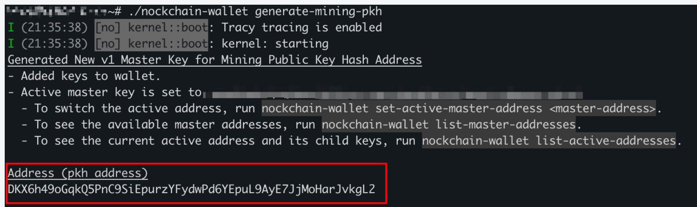

If you're new to Nock and have no idea how to use the CLI wallet, here's a minimalist tutorial you can refer to: [tutorial](./cli-wallet.md)


## Generate v1 Address

### 🧩 Prerequisites

Please **clone the source code from the official repository** at:
👉 [https://github.com/zorp-corp/nockchain](https://github.com/zorp-corp/nockchain)

Then compile the **latest version** of `nockchain-wallet` yourself.

If you happen to encounter difficulties during the compilation process and would prefer a quicker setup, you may also [download](https://github.com/GoldenMinerNetwork/nockchain-wallet/releases) **our precompiled latest release of `nockchain-wallet`** to proceed with the steps below.

---

### ⚙️ Generate a v1 Address

Once the wallet is ready, run the following command in your terminal to generate a mining address (v1 address):

First:
```bash
chmod +x nockchain-wallet
```

```bash
./nockchain-wallet generate-mining-pkh
```

And the address will look like this


After execution, you'll receive a new **v1 public key address** that can be used for mining or receiving payments.
If the command is not recognized, please make sure you are using the **latest version** of nockchain-wallet.

**Don't forget to save your Seed Phrase!**

---

### 💡 Manage Your Addresses

To view all your current addresses, run:

```bash
./nockchain-wallet list-master-addresses
```

To set which address should be used for transfers or other operations, run:

```bash
./nockchain-wallet set-active-master-addres <address>
```

Please note that you can only use a v1 address to initiate transactions after block height 39000.

For more commands and detailed usage instructions, please refer to the official documentation:
👉 [https://github.com/zorp-corp/nockchain/blob/master/crates/nockchain-wallet/README.md](https://github.com/zorp-corp/nockchain/blob/master/crates/nockchain-wallet/README.md)


## V1 Address Upgrade FAQ
**1. Why generate a new v1 address?**

After block height **39000**, only **v1 addresses** can receive transactions. Please set your v1 address to ensure normal transfers.
Settlements made before block height 39000 will continue to be sent to your v0 address, while those made afterward will be sent to your configured v1 address.

**2. When should I update my wallet address?**

Set your **v1 address before block height 39000** to avoid delayed payments

**3. My site password is weak — could someone change my address?**

Setting the **v1 address** can only be done **once** and **cannot be changed**.
If you've set it, no one can modify it.
If someone else has already set it, **create a new account**, **use a stronger password**, and continue mining — your rewards before height 39000 will still go to your **v0 address**.
Before height 39000, you can also lower your withdrawal threshold to send all previous Nocks to your **v0 address**.

**4. Do I need to restart the prover or proxy or reset the pubkey?**

No action needed.
Earnings before **height 39000** go to your **v0 address**; after that, they go to your **v1 address**.

**5. My withdrawal address is an exchange address — what should I do?**

Generate and set a **v1 address** immediately. After **height 39000**, all Nocks will be sent to your configured v1 address.

**6. What if I forget to set the v1 address before height 39000?**

We settle daily at **06:00 UTC**. If your settlement occurs after **height 39000** without a v1 address, the transfer will wait until you've set one.

**7. Should I change the --pubkey parameters in my prover/proxy to the v1 address now?**

No. If you have previously mined in our pool, please refer to item 4.

If you're a new user, you need to generate both v0 and v1 address, set the --pubkey parameter to your v0 address, and fill in a v1 address on the homepage as your payout address.

We're doing this to ensure that payments can be processed both before and after the upgrade. After the upgrade is completed, we'll release a new version of the prover/proxy that allows you to use a v1 address as the parameter.

