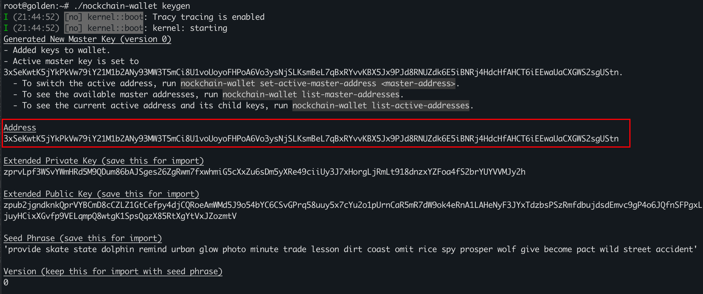
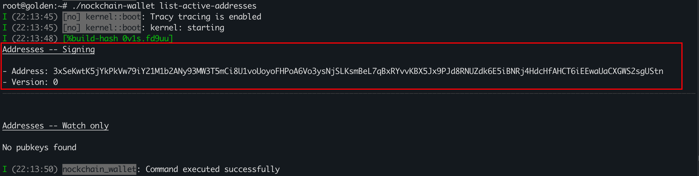
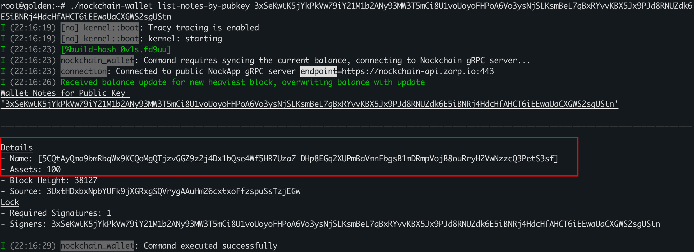
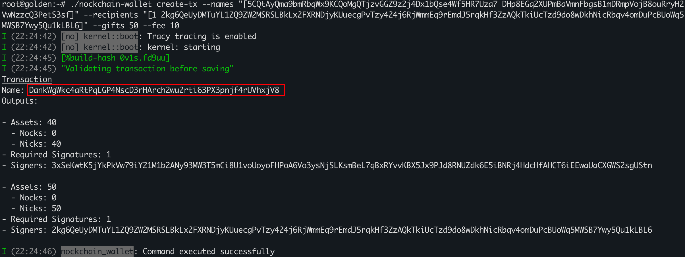
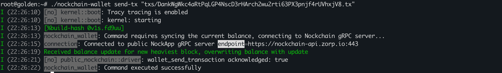
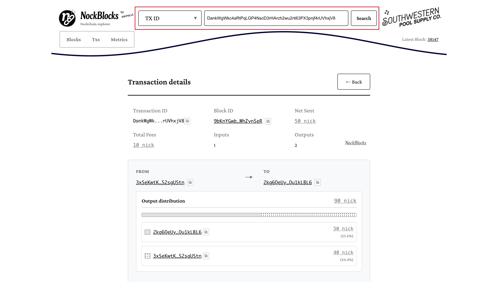

A minimalist tutorial for using the CLI wallet

---

### 1. Generate a new (v0) address  
*(If you already have an address, you can skip this step)*  

```bash
nockchain-wallet keygen
```



The current address is  
`3xSeKwtK5jYkPkVw79iY21M1b2ANy93MW3T5mCi8U1voUoyoFHPoA6Vo3ysNjSLKsmBeL7qBxRYvvKBX5Jx9PJd8RNUZdk6E5iBNRj4HdcHfAHCT6iEEwaUaCXGWS2sgUStn`.  
We'll use this address in the following steps as an example for the transaction demonstration.

**Don't forget to save your Seed Phrase!**

---

### 2. Make sure the address is active

```bash
nockchain-wallet list-active-addresses
```



**Key point:**  
- Ensure the `pubkey` appears under **<Addresses -- Signing>**.

---

### 3. List all notes (coins) for the address  

```bash
nockchain-wallet list-notes-by-pubkey <public-key>
```

**Example:**  
```bash
nockchain-wallet list-notes-by-pubkey 3xSeKwtK5jYkPkVw79iY21M1b2ANy93MW3T5mCi8U1voUoyoFHPoA6Vo3ysNjSLKsmBeL7qBxRYvvKBX5Jx9PJd8RNUZdk6E5iBNRj4HdcHfAHCT6iEEwaUaCXGWS2sgUStn
```



**Key fields in "Details":**  
- **Name**: Unique identifier of the note (coin). Use this value in the `<name>` field when creating a transaction.  
- **Assets**: Amount of **nick** this note holds (`1 Nock = 65,536 nick`).

---

### 4. Create a transaction  

```bash
nockchain-wallet create-tx \
  --names "[<name>]" \
  --recipients "[1 <recipient-pk>]" \
  --gifts <gift> \
  --fee <fee>
```

**Example:**  
```bash
nockchain-wallet create-tx --names "[5CQtAyQma9bmRbqWx9KCQoMgQTjzvGGZ9z2j4Dx1bQse4Wf5HR7Uza7 DHp8EGq2XUPmBaVmnFbgsB1mDRmpVojB8ouRryH2VwNzzcQ3PetS3sf]" --recipients "[1 2kg6QeUyDMTuYL1ZQ9ZW2MSRSLBkLx2FXRNDjyKUuecgPvTzy424j6RjWmmEq9rEmdJ5rqkHf3ZzAQkTkiUcTzd9do8wDkhNicRbqv4omDuPcBUoWq5MWSB7Ywy5Qu1kLBL6]" --gifts 50 --fee 10
```



**Key points:**  
1. Both **gifts** and **fee** are measured in *nick*.  
2. **gifts + fee** must be ≤ the **assets** value of the corresponding `<name>` note.  
3. When specifying `--recipients`, strictly use the format: `'[1 <recipient-pk>]'`.  
4. The line labeled **Transaction Name** represents the `tx-id` — use this in the next step.

---

### 5. Send the transaction  

```bash
nockchain-wallet send-tx "txs/<tx-id>.tx"
```

**Example:**  
```bash
nockchain-wallet send-tx "txs/DankWgWkc4aRtPqLGP4NscD3rHArch2wu2rti63PX3pnjf4rUVhxjV8.tx"
```



---

### 6. Check if the transaction was successful  



