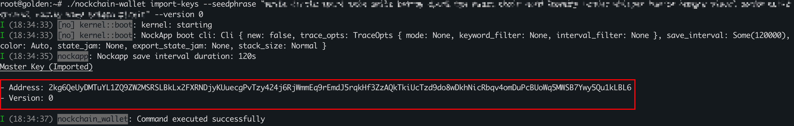
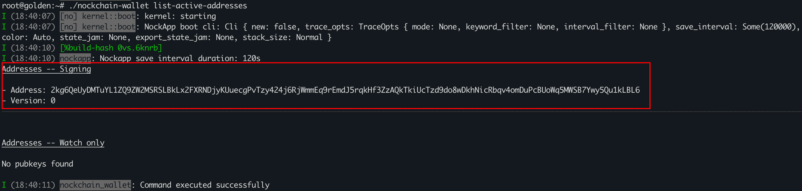
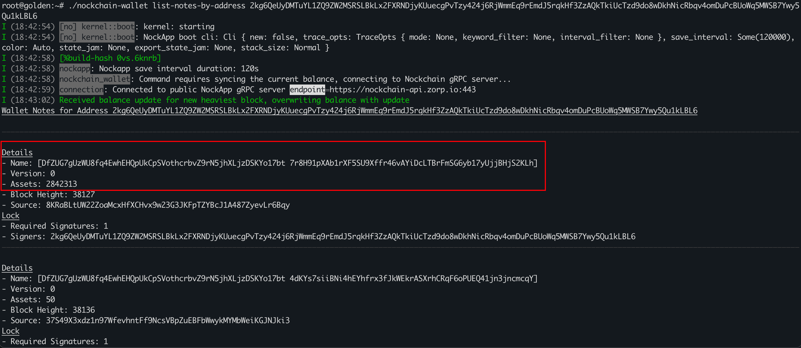
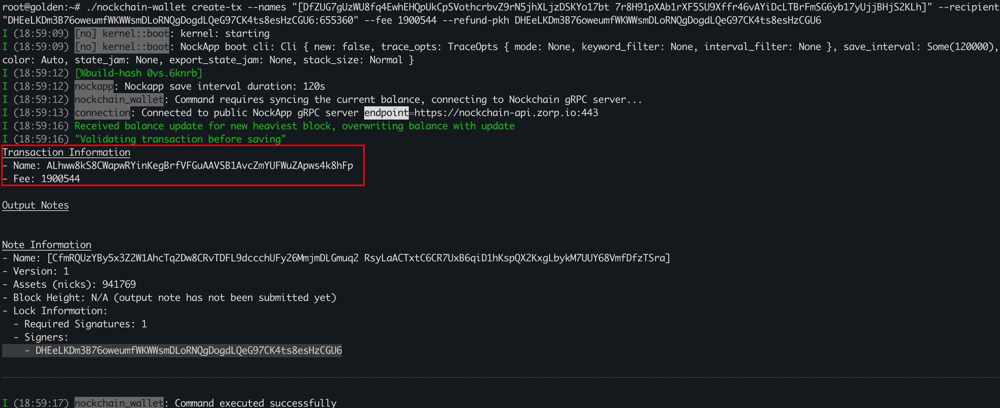
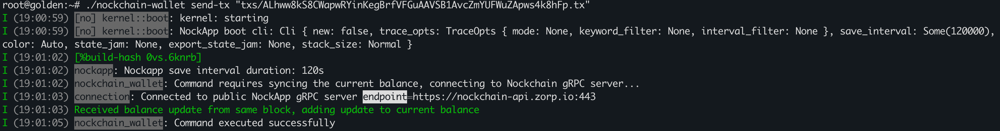
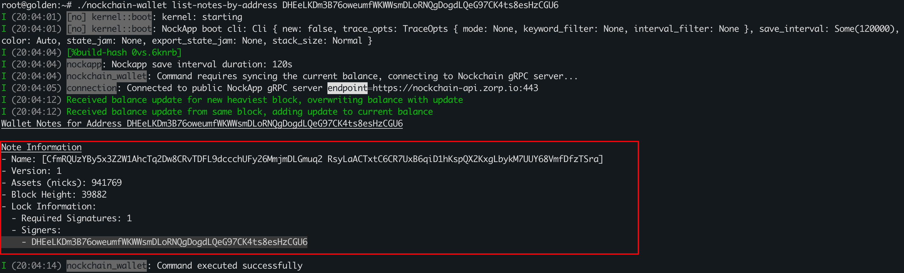

1. **Import v0 address from seed phrase**
   ```bash
   nockchain-wallet import-keys --seedphrase <seed-phrase> --version 0
   ```

   **Example:**
   ```bash
   nockchain-wallet import-keys --seedphrase "apple apple apple apple apple apple apple apple apple apple apple apple apple apple apple apple apple apple apple apple apple apple apple apple" --version 0
   ```

   

   The current address is
   `2kg6QeUyDMTuYL1ZQ9ZW2MSRSLBkLx2FXRNDjyKUuecgPvTzy424j6RjWmmEq9rEmdJ5rqkHf3ZzAQkTkiUcTzd9do8wDkhNicRbqv4omDuPcBUoWq5MWSB7Ywy5Qu1kLBL6`.
   In the following steps, this address will be used for transfer demonstrations.

---

2. **Confirm that this address is active**
   ```bash
   nockchain-wallet list-active-addresses
   ```

   

   Make sure the address appears under **Addresses -- Signing**.

   **Please make sure your address is the active address before performing any further operations!**
   Otherwise, all of your all actions may fail.
   You can set the active address using the command:
   ```
   nockchain-wallet set-active-master-address <address>
   ```
---

3. **List all notes (coins) of this address**

   Please make sure the address you are trying to query is the **active address**, otherwise it will keep showing **"No notes found"**.

   ```bash
   nockchain-wallet list-notes-by-address <pubkey>
   ```

   **Example:**
   ```bash
   nockchain-wallet list-notes-by-address 2kg6QeUyDMTuYL1ZQ9ZW2MSRSLBkLx2FXRNDjyKUuecgPvTzy424j6RjWmmEq9rEmdJ5rqkHf3ZzAQkTkiUcTzd9do8wDkhNicRbqv4omDuPcBUoWq5MWSB7Ywy5Qu1kLBL6
   ```

   

   **Key points:**
   - **Name**: The unique identifier of this note (coin). Fill it in the `<name>` field when creating a transaction.
   - **Assets**: The number of `nick`s owned by the note (1 nock = 65,536 nick).

---

4. **Create a transaction**
   ```bash
   nockchain-wallet create-tx \
     --names "[<name>]" \
     --recipient "<recipient-pkh>:<gift>" \
     --fee <fee> \
     --refund-pkh <refund-pkh>
   ```

   **Example:**
   ```bash
   nockchain-wallet create-tx --names "[DfZUG7gUzWU8fq4EwhEHQpUkCpSVothcrbvZ9rN5jhXLjzDSKYo17bt 7r8H91pXAb1rXF5SU9Xffr46vAYiDcLTBrFmSG6yb17yUjjBHjS2KLh]" --recipient "DHEeLKDm3B76oweumfWKWWsmDLoRNQgDogdLQeG97CK4ts8esHzCGU6:655360" --fee 1900544 --refund-pkh DHEeLKDm3B76oweumfWKWWsmDLoRNQgDogdLQeG97CK4ts8esHzCGU6
   ```

   

   **Key points:**
   1. Both **gift** and **fee** are measured in *nick*.
   2. The sum of all *gift + fee* values must be less than or equal to the *assets* of the corresponding note `<name>`.
   3. Both `<recipient-pkh>` and `<refund-pkh>` must be **v1** version addresses.
   4. Any remaining balance from the current transaction will automatically be sent to `<refund-pkh>`.
   5. The **Transaction Name** line represents the *tx-id*, which you will need when executing `send-tx`.

   **Note:**
   The current network fees are quite high!
   - Transferring one note: `fee = 29 nock = 1,900,544 nick`
   - Transferring multiple notes:
     `fee = number_of_notes * 29 nock = number_of_notes * 29 * 65,536 nick`

---

5. **Send the transaction**
   ```bash
   nockchain-wallet send-tx "txs/<tx-id>.tx"
   ```

   **Example:**
   ```bash
   nockchain-wallet send-tx "txs/ALhww8kS8CWapwRYinKegBrfVFGuAAVSB1AvcZmYUFWuZApws4k8Sure.tx
   ```

   
---

6. **Check whether the transaction was successful**

   **Key points:**  
   1. As of the time this document was completed, the *nockblocks* website still does not support parsing v1 transactions, so you currently cannot verify transaction success directly via the web interface.  
   2. The most basic verification method is to wait for a while (about half an hour, assuming a 10‑minute block interval) and then use the following command to check whether `<recipient-pkh>` has received the note:  
      ```bash
      nockchain-wallet list-notes-by-address <recipient-pkh>
      ```
   
      
