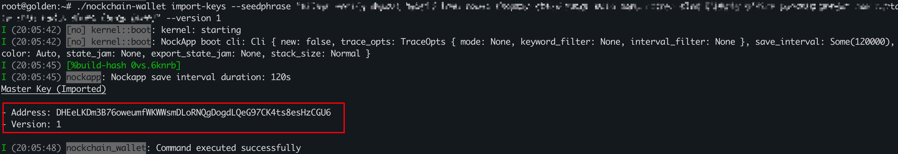

1. **Import v1 address (pkh) from seed phrase**
   ```bash
   nockchain-wallet import-keys --seedphrase <seed-phrase> --version 1
   ```

   **Example:**
   ```bash
   nockchain-wallet import-keys --seedphrase "apple apple apple apple apple apple apple apple apple apple apple apple apple apple apple apple apple apple apple apple apple apple apple apple" --version 1
   ```

   

   The current address is
   `DHEeLKDm3B76oweumfWKWWsmDLoRNQgDogdLQeG97CK4ts8esHzCGU6`.
   In the following steps, this address will be used for transfer demonstrations.

---

2. **Confirm that this address is active**
   ```bash
   nockchain-wallet list-active-addresses
   ```

   
   Make sure the address appears under **Addresses -- Signing**.

---

3. **List all notes (coins) of this address**
   ```bash
   nockchain-wallet list-notes-by-address <pubkey>
   ```

   **Example:**
   ```bash
   nockchain-wallet list-notes-by-address DHEeLKDm3B76oweumfWKWWsmDLoRNQgDogdLQeG97CK4ts8esHzCGU6
   ```

   

   **Key points:**
   In the **Details**, important fields mean:
   - **Name:** The unique identifier of this note (coin). Fill it in the `<name>` field when creating a transaction.
   - **Assets:** The number of `nick`s this note (coin) owns (1 nock = 65,536 nick).

---

4. **Create a transaction**
   ```bash
   nockchain-wallet create-tx \
     --names "[<name>]" \
     --recipient "<recipient-pkh>:<gift>" \
     --fee <fee>
   ```

   **Example:**
   ```bash
   nockchain-wallet create-tx --names "[CfmRQUzYBy5x3Z2W1AhcTq2Dw8CRvTDFL9dccchUFy26MmjmDLGmuq2 RsyLaACTxtC6CR7UxB6qiD1hKspQX2KxgLbykM7UUY68VmfDfzTSra]" --recipient "Bvb9eXwQ5y3BJNrqfU8ou6gnse6ydgdYaMJFzVrEHPm55V1m9BHbSvQ:655360" --fee 2883584
   ```

   (The process image can be referenced from the *create-tx* step in the v0-v1 guide.)

   **Key points:**
   1. Both **gift** and **fee** are measured in *nick*.
   2. The sum of all *gift + fee* values must be less than or equal to the *assets* of the corresponding note `<name>`.
   3. `<recipient-pkh>` must be a version **v1** address.
   4. The **Transaction Name** line represents the *tx-id* used when executing `send-tx`.

   **Note:**
   The current network fees are quite high!
   - Transferring one note: `fee = 44 nock = 2,883,584 nick`
   - Transferring multiple notes:
     `fee = number_of_notes * 44 nock = number_of_notes * 44 * 65,536 nick`

---

5. **Send the transaction**
   ```bash
   nockchain-wallet send-tx "txs/<tx-id>.tx"
   ```

   **Example:**
   ```bash
   nockchain-wallet send-tx "txs/ALhww8kS8CWapwRYinKegBrfVFGuAAVSB1AvcZmYUFWuZApws4k8hFp.tx"
   ```

   (The process image can be referenced from the *send-tx* step in the v0-v1 guide.)

---

6. **Check whether the transaction succeeded**

   **Key points:**
   1. At the time of writing, the *nockblocks* website still does **not support parsing v1 transactions**, so you cannot yet verify success directly via the web interface.
   2. The most basic verification method: wait for some time (about half an hour, assuming a 10-minute block generation interval) and then run
      ```bash
      nockchain-wallet list-notes-by-address <recipient-pkh>
      ```
      to check whether `<recipient-pkh>` has received new notes.

   (You can refer to the *check-tx* step in the v0-v1 guide for reference pictures.)
